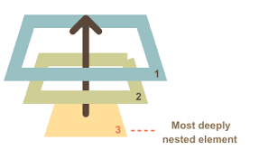

## Event Bubbling and Delegation

### Bubbling
The bubbling principle is simple.When an event happens on an element, it first runs the handlers on it, then on its parent, then all the way up on other ancestors.
Let’s say we have 3 nested elements  `FORM > DIV > P`  with a handler on each of them:
```markup
<style>
  body * {
    margin: 10px;
    border: 1px solid blue;
  }
</style>

<form onclick="alert('form')">FORM
  <div onclick="alert('div')">DIV
    <p onclick="alert('p')">P</p>
  </div>
</form>
```
A click on the inner  `<p>`  first runs  `onclick`:

1.  On that  `<p>`.
2.  Then on the outer  `<div>`.
3.  Then on the outer  `<form>`.
4.  And so on upwards till the  `document`  object.
So if we click on  `<p>`, then we’ll see 3 alerts:  `p`  →  `div`  →  `form`.

The process is called “bubbling”, because events “bubble” from the inner element up through parents like a bubble in the water.
Event bubbling is supported in all browsers, and it works for all handlers, regardless of how they are registered e.g. using `onclick` or `addEventListener()`

###  Stopping bubbling
A bubbling event goes from the target element straight up. Normally it goes upwards till  `<html>`, and then to  `document`  object, and some events even reach  `window`, calling all handlers on the path.

But any handler may decide that the event has been fully processed and stop the bubbling.

The method for it is  `event.stopPropagation()`.
```markup
<body onclick="alert(`the bubbling doesn't reach here`)">
  <button onclick="event.stopPropagation()">Click me</button>
</body>
```
For instance,  focus, blur and scrol event does not bubble_
 
